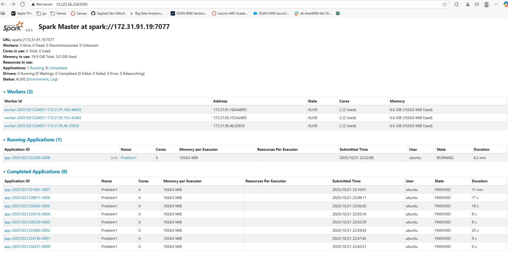
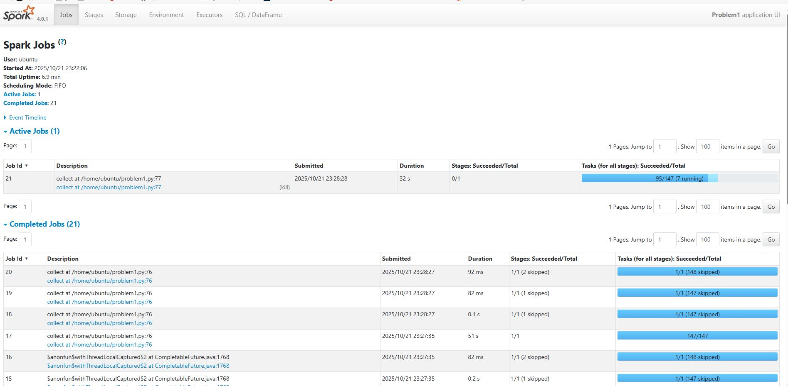
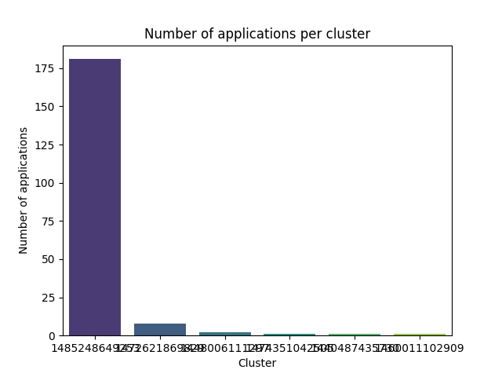
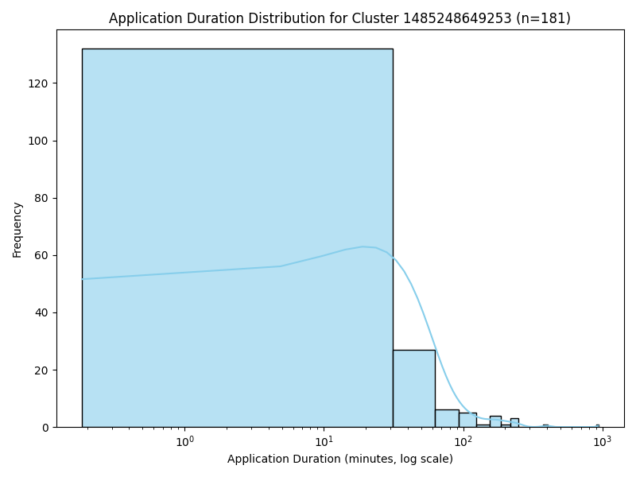
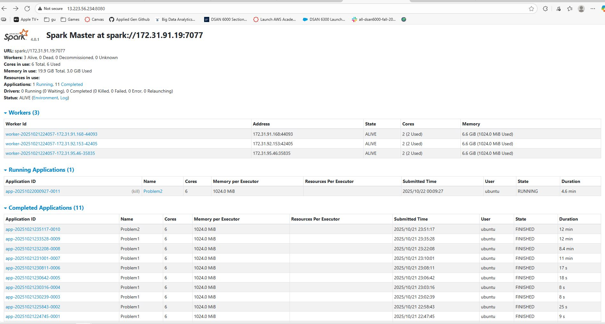
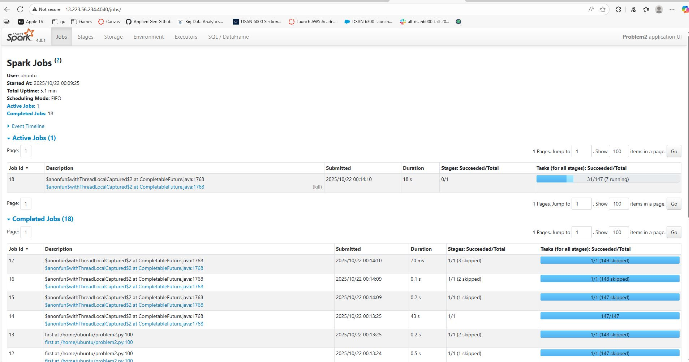

# DSAN 6000 Assignment 6: Spark Cluster Log Analysis  
**Name:** Jonah Lichtenthal  
**Date:** October 21, 2025  

## Problem 1

In this problem the goal was the get a better understanding of the distribution of different log types in the dataset. The pipeline for this project was as follows:

- Read/Parse log data
- Count log levels
- Print 10 random sample log entries with their levels
- Print summary statistics

These different log types include INFO, WARN, ERROR, and DEBUG. In this problem I first found this ditribution of log types which was as follows:

| log_level |   count   |
|------------|-----------|
| DEBUG      | 5826268   |
| ERROR      | 11259     |
| INFO       | 27389482  |
| WARN       | 9595      |

Next I listed 10 random logs in order to get a better feeling of what each of these logs actually looks like which resulted in the following:

| message                                                                                                                                                                                                                                                                   | log_level |
|--------------------------------------------------------------------------------------------------------------------------------------------------------------------------------------------------------------------------------------------------------------------------|------------|
| 17/06/09 11:52:21 INFO storage.MemoryStore: Block broadcast_3869 stored as values in memory (estimated size 9.9 KB, free 806.1 KB)                                                                                                | INFO       |
| 17/06/09 09:50:47 INFO python.PythonRunner: Times: total = 42, boot = 17, init = 25, finish = 0                                                                                             | INFO       |
| 17/06/08 12:21:14 INFO output.FileOutputCommitter: Saved output of task 'attempt_201706081211_0274_m_000002_10963' to hdfs://10.10.34.11:9000/pjhe/test/5/_temporary/0/task_201706081211_0274_m_000002 | INFO       |
| Update row: 519026                                                                                                                                                                          |            |
| Update row: 480493                                                                                                                                                                          |            |

Finally, I printed out some summary statistics to get a better general idea of what the data looks like:

Total log lines processed: 33236604                                             
Total lines with log levels: 27410336                                           
Unique log levels found: 4                                                      
Log level distribution:                                     
INFO : 27389482  (82.41 %)                                                      
ERROR : 11259  (0.03 %)                                                      
WARN : 9595  (0.03 %)                                                      
DEBUG: 5826268  (17.53 %)                                                      

All of this information was saved in csv or txt files for later analysis. 

### Insights

- What I found is that the most common type of log contributing to 82.41% of logs is INFO which makes sense since usually we probably expect everything to run fine
- Warn and Error and reasonably rare contributing to only 0.03% of logs each
- Debug contains the remaining logs which is anything that is not a normal log or error/warning

**Cluster Usage Patters:**

- Execution time was about 11 minutes

- Writing the summary was the most time-consuming because it required several counts and calculations across the dataset, whereas printing the 10 random rows completed quickly since it only processed a small subset of the data.

- Cluster version ran much faster than the local version because it distributed the data and computations across multiple nodes

**Spark UI secrrnshots:**

Problem 1 MasterUI Screenshot

  

Problem 1 ApplicationUI Screenshot

  

- We can confirm from these screenshots that both cores of all 3 workers are in use solving the problem

### Optimizations

- I updated the summary section in Problem 1 to avoid recalculating the same values multiple times. The code now stores key results like counts and percentages in variables first, which makes it much faster.

## Problem 2

In this problem the goal was to analyze cluster usage patterns and generate insightful visualizations to better understand how the cluster was utilized. The pipeline for this project was as follows:

- Read/Parse log data
- Extract application and container IDs
- Convert timestamp to timestamp format
- Create time-series data for each application
- Compute aggregated cluster statistics
- Print summary statistics
- Create bar chart
- Create density plot

The summery statistics I printed out are as follows:

Total unique clusters: 6                                                        
Total applications: 194                                                         
Average applications per cluster: 32.33     

Most heavily used clusters:                                        
    Cluster 1485248649253: 181 applications                                         
    Cluster 1472621869829: 8 applications                                        
    Cluster 1448006111297: 2 applications                                        
    Cluster 1474351042505: 1 applications                                        
    Cluster 1440487435730: 1 applications                                        
    Cluster 1460011102909: 1 applications                                        

The bar chart created:

  

The density plot created: 

  

### Insights

- Execution time was about 13 minutes 

- One cluster did the majority of the applications while 4/6 of the clusters barely did any applications

- The bar chart visualizes just how imbalanced the work distribution was between the different clusters

- The density plot shows that most of the applications ran very fast in the first couple minutes with only a couple allications causing the job to run so long. This also makes sense with our other following that many of our clusters did very few jobs which likely means the jobs those clusters did do were very computationally extensive.

**Cluster Usage Patters:**

- Execution time was about 11 minutes

- The group-by and summary steps were the most time-consuming because they required distributed shuffling and aggregation of data across executors, whereas finding the largest cluster ID completed quickly since it only accessed a single ordered record.

- Cluster version ran much faster than the local version because it distributed the data and computations across multiple nodes

**Spark UI secrrnshots:**

Problem 2 MasterUI Screenshot

  

Problem 2 ApplicationUI Screenshot

  

- We can confirm from these screenshots that both cores of all 3 workers are in use solving the problem

### Optimizations

- Changed method for retrieving the largest cluster ID from converting the entire DataFrame to Pandas and selecting the first row to instead selecting the first ID directly from the ordered Spark DataFrame

